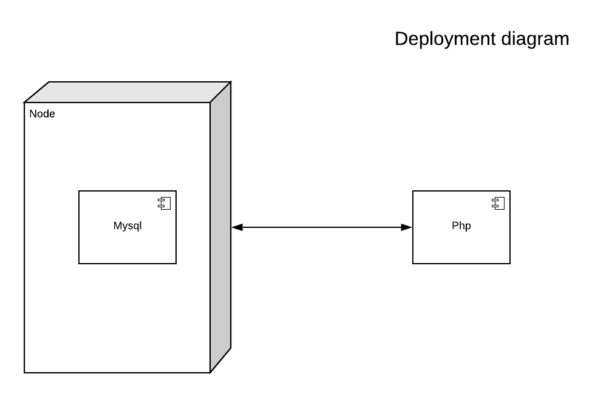
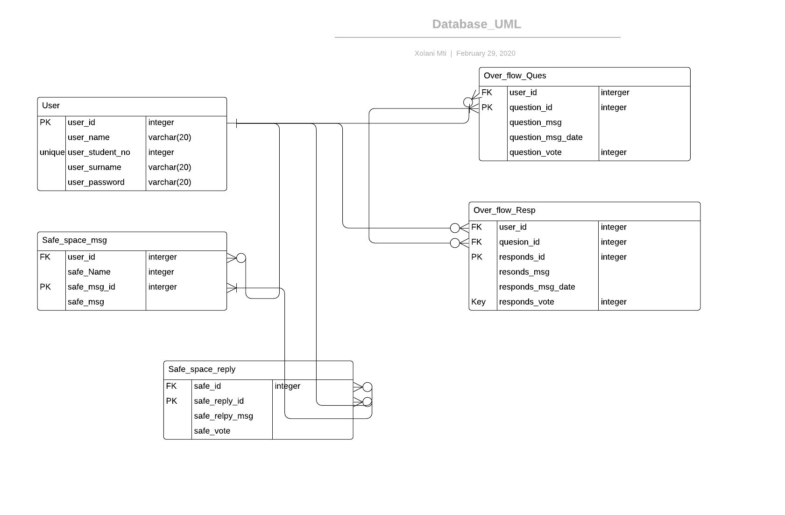
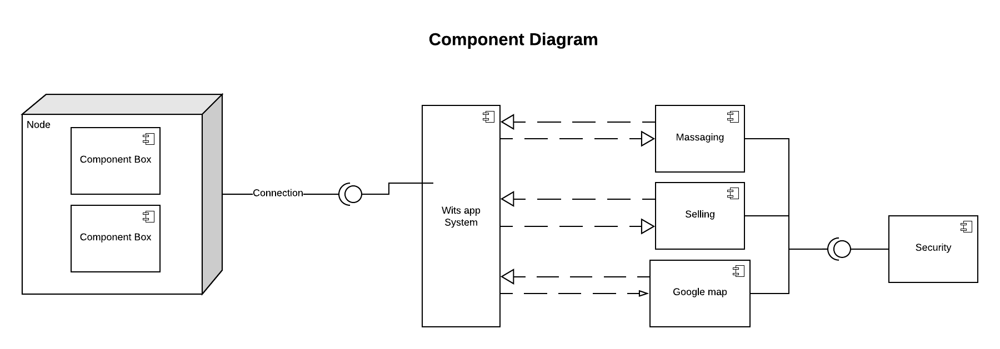

# TheWitsApp

This is the web-version of the WitsApp. The different diagrams below explain the apps frontend and backend.
# State Diagram

* Represents the  parts of the system at a finite instance of time
# Deployment Diagram

* It's the physical aspects of the object orieted programming
# Class Diagram

* Describes the structure of software, code, by showing the class, attributes, methods, etc.
# Database Diagram

* Descibes the database tables, it illustrated the table relationships with connecting lines.
# Use case diagram

* It's the primary form of system/software requirements for a new software system. They specify the expected
behaviour and the not so exact method of making it happen.
# Component Diagram

* Describes the organization and writing of the physical component in a system.
# Sequece Diagram

* Show the sequence of events 
